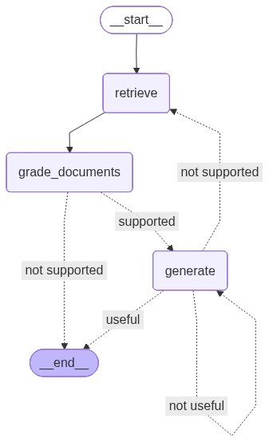

# Proje Geliştirme Süreci

İlk olarak problemi çözmek için genel bir mimari tasarladım ve belge tabanlı soru-cevap sistemi geliştirmek amacıyla bir RAG yapısı kurmaya karar verdim.

Sistemin tamamen on-premise çalışmasını hedefledim. Bu yaklaşımı seçmemin iki temel nedeni vardı: internet bağlantısının bulunmadığı bilgisayarlarda kullanılabilmesi ve olası veri sızıntılarını engelleyerek veri güvenliğinin sağlanması.

Bu süreçte LangChain ve LangGraph teknolojilerini öğrenerek agent tabanlı bir mimari geliştirmeye başladım. Templateyi Gemini API kullanarak oluşturdum ve RAG sisteminin temel bileşenlerini test ettim. Daha sonra sistemi Gradio üzerinden çalıştırdım. İlk başta chat geçmişi tutulmadan denedim, sonradan bunu bir chatbot haline getirdim.

Chroma veritabanı tarafında, her çalıştırmada veritabanının yeniden oluşturulmasını tercih ettim. Böylece daha önce yüklenmiş PDF dosyalarından kalan verilerin sonraki sorguları etkilemesinin önüne geçtim.

Belge işleme aşamasında OCR kullanılması gerektiğine karar verdim. Kullanılacak dokümanların Türkçe ve İngilizce olacağını göz önünde bulundurarak farklı OCR çözümlerini araştırdım ve Tesseract OCR'ın doğruluk, kullanım kolaylığı ve local çalışmasıyla en uygun seçenek olduğuna karar verdim.

Embedding modeli seçimi için çeşitli modelleri test ettim. Bunlar:

* all-MiniLM
* gte-small
* bert-base-turkish-cased-mean-nli-stsb-tr
* nomic-embed-text

Yaptığım testler sonucunda doğruluk oranı, çok dillilik desteği ve belge dili ile soru dili farklı olduğunda da başarılı sonuçlar verebilmesi nedeniyle BGE-M3 (567M) modelini tercih ettim.

Chuning sırasında PDF içerisindeki tablolar düz metin olarak algılanıyor ve satır-sütun ilişkileri kaybolduğu için anlam bütünlükleri bozuluyordu. Bu problemi çözmek amacıyla PDF dosyalarını dönüştürmeden önce ek ön işleme adımları uyguladım ve tabloların yapısal bütünlüğünü mümkün olduğunca korumaya çalıştım.

PDF dosyalarından Markdown üretmek için Docling kütüphanesini kullandım. Ubuntu'da sorunsuz çalışsa da, Windows'ta backend kaynaklı path hataları veriyordu. Yaptığım araştırmalar sonucunda backend'i `PyPdfiumDocumentBackend` olarak değiştirdiğimde problemin çözüldüğünü tespit ettim.

Local dil modeli tarafında başlangıçta Hugging Face üzerinden indirilen Qwen modellerini kullandım. Ancak bu modellerde `.with_structured_output()` metodunun desteklenmediğini gördüm. Bu modelleri `JsonOutputParser` ile denedim fakat model boyutunun yetersiz olması nedeniyle agentlar belirlenen JSON formatında çıktı üretmiyordu, bu da LangGraph akışının tamamlanamamasına neden oluyordu. Bu sebeple Ollama üzerinden çalışan yerel Qwen modellerine geçiş yaptım.

OCR aşamasında ise Türkçe karakterlerle ilgili çeşitli problemler yaşadım. Denediğim OCR modellerinin çoğu Türkçe karakterleri doğru şekilde tanıyamıyordu. Ayrıca OCR çıktılarında ve bozuk formatlanmış PDF dosyalarında karakter kodlama hatalarıyla karşılaştım. Örneğin:

**PDF Örnek**

"Ba ̧ sarım oranı yüksek bir dil modelinin e ̆ gitilebilmesi için gerekli olan en önemli a ̧ samalardan birisi çok büyük ve ön i ̧ slemden geçmi ̧ s bir metin verisetinin hazırlanmasıdır."

**OCR ile Resimden Alınmış Bir Örnek**:

Orijinal metin -> Oliver Sacks 1933 yılında Londra'da, doktorlar ve bilim insanlarının çoğunlukta olduğu bir ailenin (annesi cerrah, babası aile hekimiydi) üyesi olarak dünyaya geldi.

OCR çıktısı -> Oliver Sacks 1933ylnda Londrada,doktorlar ve bilim insanlarinin olarak dunyaya geldi

Bu hatalar genellikle Türkçe karakterlerin ayrışması ve OCR modellerinin TÜrkçe karakterlere yeterince duyarlı olmamasından kaynaklandığını düşündüm.

## Graph Yapısı

Sistemi, LangGraph kullanılarak bir workflow şeklinde tasarladım. Temel amacım hatalı ,eksik bilgi üretimini ve halüsinasyon önleyen Self-Reflective RAG kurmaktı.

**Düğümler (Nodes):**
* **RETRIEVE:** Kullanıcının sorusuna göre vektör veritabanından ilgili belgeleri getirir.
* **GRADE_DOCUMENTS:** Getirilen belgelerin soruyla alakalı olup olmadığını değerlendirir.
* **GENERATE:** İlgili belgelere dayanarak dil modeli ile soruya cevap üretir.

**Zincirler ve Karar Mekanizmaları (Chains & Edges):**
* Akış `RETRIEVE` düğümüyle başlar ve ardından belgeler `GRADE_DOCUMENTS` ile değerlendirilir.
* **`decide_to_generate` Kararı:** Belgeler soruyla alakalıysa üretime (`GENERATE`) geçilir, değilse akış sonlandırılır (`END`).
* **`grade_generation` Kararı:** Üretilen cevap çok aşamalı kontrolden geçer:
  1. **`hallucination_grader`:** Cevabın belgelere dayanıp dayanmadığını kontrol eder.
  2. **`answer_grader`:** Cevabın soruyu gerçekten yanıtlayıp yanıtlamadığını kontrol eder.
* **Sonuç:** Cevap başarılı ve doğruysa (`useful`) akış biter. Cevap soruyu karşılamıyorsa tekrar üretilir (`not useful`). Cevap belgelerle desteklenmiyorsa yeni belge getirmek için başa (`RETRIEVE`) dönülür. Maksimum deneme sayısına ulaşıldığında ise mevcut cevap kabul edilir.

## Şu Anki Bildiklerimle Baştan Yapacak Olsaydım Neleri Farklı Yapardım? 

Öncelikle OCR modelini Türkçe için fine-tune ederdim ve bilgileri daha iyi ayrıştırırdım.
Kullanıcı arayüzünü Gradio ile yapmak yerine daha esnek bir şekilde yapardım. Bu arayüzden hem on-premise hem de API key ile kullanılabilecek esnek bir yapı kurardım.
PDF'lerden ve görüntülerden çıkarılan verilerin kalitesini artırmak için çıktılarını daha detaylı inceler ve buna göre ek ön işleme adımlarını çoğaltırdım.
PDF'lerdeki görselleri de yorumlatmak için bir VLM modeli eklerdim.
Chunking stratejilerini daha sistematik test ederdim.

## Referanslar

https://docs.langchain.com/ 
https://doi.org/10.48550/arXiv.2410.15944 \
https://github.com/pixegami/rag-tutorial-v2 \
https://huggingface.co/learn/cookbook/advanced_rag \
https://github.com/GiovanniPasq/agentic-rag-for-dummies \
https://www.udemy.com/course/langchain-langgraph/ \
https://doi.org/10.48550/arXiv.2602.03693 
