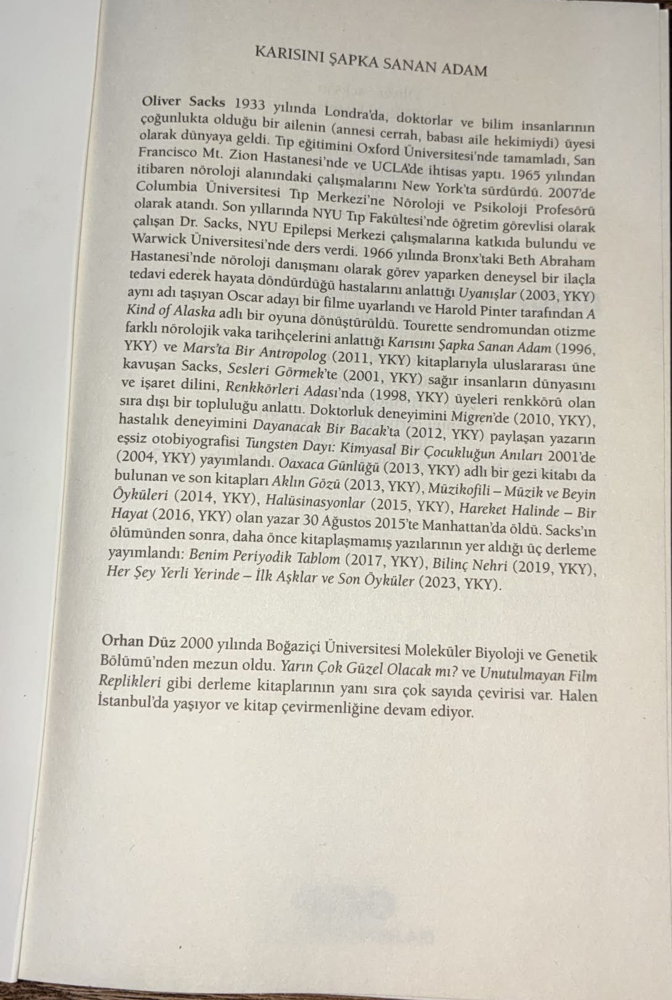

##  Deneme 1 — OCR ile Türkçe Kitap Sayfası
 
Türkçe yazılmış bir kitabın ilk sayfasının resmi yüklendi ve OCR çıktısı üzerinden sorular soruldu.
 
**Örnek Belge:**
 
\

## OCR Çıktısı: ##
## KARISINI SAPKASANAN ADAM

Oliver Sacks 1933ylnda Londrada,doktorlar ve bilim insanlarinin olarak dunyaya geldiTip egitimini Oxford Universitesi'nde tamamladSan Columbia Universitesi Tip Merkezine Noroloji ve Psikoloji Profesoru olarakatandSon yillarndaNYUTipFakultesndegretim gorevlisiolarak calisan Dr.Sacks,NYU EpilepsiMerkezi calsmalarina katkida bulundu e tedavi ederek hayata dondurdugu hastalarini anlattg Uyanislar (2003, YKY) ayni ad tasiyan Oscar adayi bir filme uyarlandi ve Harold Pinter tarafindan A Kind of Alaska adli bir oyuna donusturulduTourette sendromundan otizme YKY) ve Marsta Bir Antropolog (201l,YKY) kitaplariyla uluslararasi uine kavusan Sacks, Sesleri Gormek'te (2001, YKY) sagir insanlarin dunyasini ve isaret dilini,Renkkorleri Adas'nda (1998,YKY) uyeleri renkkoru olan sira disi bir toplulugu anlatt.Doktorluk deneyimini Migren'de (2010,YKY), hastalk deneyimini Dayanacak Bir Bacakta (2012,YKY) paylasan yazarin essiz otobiyografisi Tungsten Dayi:Kimyasal Bir Cocuklugun Anilar 2001'de (2004,YKY)yayimland1.Oaxaca Gunlugu (2013,YKY)adli bir gezi kitabi da bulunanve sonkitaplariAklin Gozu(2013,YKY),Muzikofili-MuzikveBeyin Oykuleri (2014,YKY),Halusinasyonlar(2015,YKY),Hareket Halinde-Bir Hayat(2016,YKY)olan yazar30Agustos2015teManhattanda oldu.Sacksin olumunden sonra,daha oncekitaplasmamisyazilarinin yer aldigi uc derleme yayimland:Benim Periyodik Tablom (2017,YKY),BilincNehri (2019,YKY), Her Sey Yerli Yerinde - ilk Asklar ve Son Oykuler (2023, YKY).

Orhan Duz 2000 yilinda Bogazici Universitesi Molekuler Biyoloji ve Genetik Bolumu'nden mezun oldu.Yarin Cok Guzel Olacak m?ve Unutulmayan Film Replikleri gibi derleme kitaplarinin yani sira cok sayida cevirisi var.Halen Istanbul'da yasiyor ve kitap cevirmenligine devam ediyor.

Chat History:

- Soru: Oliver Sacks ne zaman doğdu? 
- Cevap: Oliver Sacks, 1933 yılında doğdu.
- Soru: Which university did he graduate from?
- Cevap: He graduated from Oxford University.
- Soru: Asıl mesleği ne? 
- Cevap: His main profession was medicine.
- Soru: Kitabı kim çevirmiş? 
- Cevap: The document does not specify who translated the book.
- Soru: Who did translate this book? 
- Cevap: The document does not specify who translated the book.

Doküman dilinden bağımsız, sorunun diline göre cevapla promptuna rağmen her zaman prompta sadık kalmadı. 
Retrieval eğer hiç alakalı sonuç getirmeseydi cevap "Yüklenen belgede bu soruya ilişkin bir bilgi bulunamadı. No relevant information found in the uploaded document" olmalıydı ama burada getirilen dökümanlar alakasız diye değerlendirip cevap verilmedi.

## Deneme 2 — Akademik Makale

 
Daha önce okunan bir makale yüklendi: [arXiv:2602.19944](https://doi.org/10.48550/arXiv.2602.19944)

Chat History:
- Soru: What is this paper about? 
- Cevap: This paper presents a progressive mechanism for zero-shot camouflaged object segmentation, focusing on discovering, segmenting, and selecting concealed objects in images. It introduces a prompt template that guides the identification of hidden objects by comparing overlap masks from original and candidate masks. The method emphasizes step-by-step object detection and selection based on primary and secondary criteria. The approach is evaluated using datasets and methods like CAMO, NC4K, and CHAMELEON. The paper is authored by researchers from Xiamen University and published in the AAAI conference.
- Soru: DSS mimarisi hangi parçalardan oluşuyor? 
- Cevap: DSS mimarisi, Discover, Segment ve Select adımlarından oluşur. Discover aşamasında, MLLM'lerin semantik işaretleri ve görsel özellik kümeleme ile yapısal öncelikler kullanılarak çeşitli ve kaliteli bölgeler önerilir. Segment aşamasında, bu öneriler SAM ile kullanılarak çoklu ince çizgi kandidat maskeler oluşturulur. Select aşamasında, MLLM, tüm kandidatları değerlendirme yaparak bir seçim süreci gerçekleştirir.
- Soru: Could this be used in real-time?
- Cevap: The paper does not provide explicit information about real-time performance. While the Heuristic Rules baseline achieves low latency (1.14 s/image), the full DSS pipeline involves multiple steps and models, which may limit real-time applicability. Without specific inference speed data for the complete system, a definitive answer cannot be given. Therefore, it is uncertain if this can be used in real-time.
- Soru: Askeri alanda kullanılabilir mi? 
- Cevap: Evet, bu yöntem, askeri alanlarda camoufajlı nesnelerin tespit edilmesi için kullanılabilecek bir çözüm sunar. Özellikle hava araçlarıyla yapılan askeri gözetim sistemlerinde, camoufajlı nesnelerin hızlı ve doğru tanımlanması açısından uygundur. Referans [23]’te, askeri camoufaj nesneleri tespit için bir modelin kullanımı yer alır. Bu nedenle, askeri uygulamalarda potansiyel bir uygulama alanı sunar.
- Soru: Nasıl for loop yazarım? 
- Cevap: Yüklenen belgede bu soruya ilişkin bir bilgi bulunamadı. No relevant information found in the uploaded document.
- Soru: Explain the tables
- Cevap: The tables compare different methods for camouflaged object segmentation across datasets like CAMO, NC4K, and COD10K. Each row represents a method (e.g., HitNet, SENet, ZoomNeXt), and columns show performance metrics such as segmentation accuracy (F), mask selection accuracy (↑ M ↓ S α), and evaluation scores (Eϕ, F). "F", "U", and "ZS" denote fully-supervised, unsupervised, and zero-shot methods respectively. The best results in each setting are highlighted in bold or colored (red, blue, green). "OOM" indicates out-of-memory errors, and "–" means data not available. The tables evaluate overall performance using a composite score combining multiple metrics.

## Analizler
 
- Daha iyi bir OCR modeli kullanılması, özellikle Türkçe karakterler ve bitişik kelimeler konusundaki hataları önemli ölçüde azaltacaktır.
- Daha iyi bir embedding modeli, retrieval kalitesini artıracak ve alakalı içeriğin "alakasız" olarak yanlış değerlendirilmesi sorununu büyük ölçüde çözecektir.
- Daha güçlü bir LLM, dil yönergelerine daha tutarlı biçimde uyarak sorunun diline göre yanıt verme konusunda daha başarılı olacaktır.
- Sistem tamamen yerel ortamda çalıştığından embedding oluşturma ve cevap üretme süreleri doküman boyutuna göre değişmektedir, yapılan denemelerde her iki adım da ortalama **~1 dakika** civarında tamamlandı.
